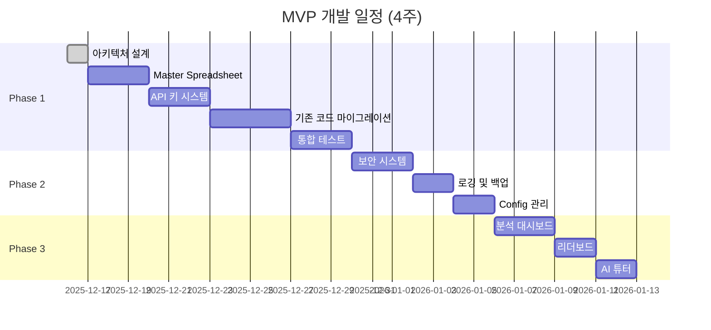

# MVP 범위 및 구현 계획

> **작성일**: 2025-12-16  
> **목표**: 4주 내 다중 학교 지원 MVP 완성

---

## 🎯 MVP 철학

**핵심 원칙**: "완벽한 전체보다 작동하는 핵심"

현재 시스템의 **핵심 가치**를 유지하면서, **다중 학교 지원**을 추가하는 것이 MVP의 목표입니다.

---

## 📊 3단계 MVP 계획

### Phase 1: 핵심 인프라 (2주) 🔴 필수

**목표**: 다중 학교 데이터 분리 및 기본 동작

#### 포함 기능

1. **학교별 데이터 분리** ⭐⭐⭐⭐⭐
   - Master Spreadsheet 생성
   - Schools 시트 구조 확립
   - 학교별 독립 스프레드시트 생성
   - 학교 ID 체계 (SCH001, SCH002, ...)

2. **기본 CRUD 작업** ⭐⭐⭐⭐⭐
   - 학생 데이터 조회 (학교별 격리)
   - 학생 진도 업데이트
   - 온도 시스템 유지
   - Google Sheets 동기화

3. **API 키 기반 보안** ⭐⭐⭐⭐⭐
   - 학교별 API 키 발급
   - 요청 시 API 키 검증
   - 학교 데이터 격리 보장

4. **기존 핵심 기능 유지** ⭐⭐⭐⭐⭐
   - 3단계 학습 구조 (기초 → 주제별 → 연도별)
   - 이론 타이핑 시스템 (94% 정확도)
   - 퀴즈 및 오답 노트
   - 온도 기반 게이미피케이션

#### 제외 기능 (Phase 2 이후)

- ❌ 관리자 UI (수동 관리로 대체)
- ❌ 학교 간 리더보드
- ❌ 고급 분석 대시보드
- ❌ 자동 이메일 알림

#### 성공 기준

- [ ] 2개 학교로 테스트 성공
- [ ] 기존 기능 100% 작동
- [ ] API 응답 시간 3초 이내
- [ ] 데이터 격리 검증 완료

#### 개발 일정

```
Week 1 (12/16 - 12/22):
- [x] 아키텍처 결정 확정
- [ ] Master Spreadsheet 설계 및 생성
- [ ] Schools 시트 구조 구현
- [ ] 학교 생성 자동화 스크립트

Week 2 (12/23 - 12/29):
- [ ] API 키 검증 시스템 구현
- [ ] 학교별 데이터 조회 로직
- [ ] 기존 코드 마이그레이션
- [ ] 통합 테스트
```

---

### Phase 2: 보안 및 관리 (1주) 🟡 중요

**목표**: 안정적인 운영을 위한 보안 및 관리 기능

#### 포함 기능

1. **관리자 인증** ⭐⭐⭐⭐
   - 이메일 기반 관리자 인증
   - 학교별 관리자 권한 분리
   - 관리자 UI (간단한 버전)

2. **로깅 및 모니터링** ⭐⭐⭐⭐
   - ErrorLog 시트 구현
   - 주요 작업 감사 로그
   - 오류 발생 시 이메일 알림

3. **백업 시스템** ⭐⭐⭐⭐
   - 학교별 자동 백업 (일일)
   - Google Drive 백업 저장
   - 30일 보관 정책

4. **Config 기반 설정 관리** ⭐⭐⭐
   - 전역 Config (Master)
   - 학교별 Config
   - 캐시 서비스 통합

#### 성공 기준

- [ ] 관리자 인증 작동
- [ ] 오류 로그 자동 기록
- [ ] 백업 자동화 완료
- [ ] Config 변경 시 재배포 불필요

#### 개발 일정

```
Week 3 (12/30 - 1/5):
- [ ] SecurityService.gs 구현
- [ ] LoggingService.gs 구현
- [ ] BackupService.gs 구현
- [ ] ConfigService.gs 구현
- [ ] 관리자 UI 기본 버전
```

---

### Phase 3: 고급 기능 (1주) 🟢 선택

**목표**: 사용자 경험 향상 및 차별화 기능

#### 포함 기능

1. **학교별 분석 대시보드** ⭐⭐⭐
   - 학교 전체 학습 통계
   - 학생별 진도 현황
   - 취약 단원 분석

2. **학교 내 리더보드** ⭐⭐⭐
   - 같은 학교 학생끼리만 순위
   - 온도 기반 랭킹
   - 실시간 업데이트

3. **주간 리포트 이메일** ⭐⭐
   - 관리자에게 주간 요약 발송
   - 학습 현황 통계
   - 주요 지표 (활성 학생 수, 평균 정답률)

4. **AI 튜터 기능 완성** ⭐⭐
   - Gemini API 연동 완료
   - 학교별 질문 로그
   - 자주 묻는 질문 분석

#### 제외 기능 (향후 버전)

- ⏸️ 학교 간 리더보드 (경쟁 기능)
- ⏸️ 모바일 앱
- ⏸️ 실시간 협업 학습
- ⏸️ 자격증 종류 확장

#### 성공 기준

- [ ] 분석 대시보드 작동
- [ ] 리더보드 실시간 업데이트
- [ ] 주간 리포트 자동 발송
- [ ] AI 튜터 응답 시간 5초 이내

#### 개발 일정

```
Week 4 (1/6 - 1/12):
- [ ] AnalyticsService.gs 구현
- [ ] 리더보드 학교별 필터링
- [ ] NotificationService.gs 구현
- [ ] AI 튜터 Gemini 연동
- [ ] 최종 통합 테스트
```

---

## 📋 Phase별 상세 기능 매트릭스

| 기능 | Phase 1 | Phase 2 | Phase 3 | 비고 |
|------|---------|---------|---------|------|
| **데이터 관리** |
| 학교별 스프레드시트 분리 | ✅ | - | - | 필수 |
| 학생 CRUD | ✅ | - | - | 필수 |
| 진도 동기화 | ✅ | - | - | 필수 |
| **보안** |
| API 키 검증 | ✅ | - | - | 필수 |
| 관리자 인증 | - | ✅ | - | 중요 |
| 데이터 격리 | ✅ | - | - | 필수 |
| **학습 기능** |
| 3단계 학습 구조 | ✅ | - | - | 필수 |
| 이론 타이핑 | ✅ | - | - | 필수 |
| 퀴즈 시스템 | ✅ | - | - | 필수 |
| 오답 노트 | ✅ | - | - | 필수 |
| **관리** |
| 오류 로깅 | - | ✅ | - | 중요 |
| 자동 백업 | - | ✅ | - | 중요 |
| Config 관리 | - | ✅ | - | 중요 |
| **분석** |
| 학교별 통계 | - | - | ✅ | 선택 |
| 리더보드 | - | - | ✅ | 선택 |
| 주간 리포트 | - | - | ✅ | 선택 |
| **고급 기능** |
| AI 튜터 | - | - | ✅ | 선택 |

---

## 🎯 MVP 우선순위 결정 기준

### P0 (필수) - Phase 1에 포함
- 시스템 작동에 필수적인 기능
- 다중 학교 지원의 핵심
- 기존 사용자 경험 유지

### P1 (중요) - Phase 2에 포함
- 안정적인 운영에 필요
- 보안 및 관리 기능
- 문제 발생 시 빠른 대응 가능

### P2 (선택) - Phase 3에 포함
- 사용자 경험 향상
- 차별화 기능
- 없어도 시스템 작동

### P3 (미래) - MVP 이후
- 장기적 비전
- 대규모 확장 시 필요
- 현재는 불필요

---

## 📅 전체 일정 요약



**총 개발 기간**: 4주 (12/16 ~ 1/12)

---

## ✅ Phase별 완료 체크리스트

### Phase 1 체크리스트

**설계 및 준비**
- [x] 데이터베이스 구조 결정
- [x] 학교 식별자 형식 결정
- [ ] Master Spreadsheet 스키마 확정
- [ ] API 명세서 작성

**구현**
- [ ] Master Spreadsheet 생성
- [ ] Schools 시트 구현
- [ ] 학교 생성 스크립트
- [ ] API 키 검증 로직
- [ ] 학교별 데이터 조회
- [ ] 기존 코드 리팩토링

**테스트**
- [ ] 단위 테스트 작성
- [ ] 2개 학교로 통합 테스트
- [ ] 성능 테스트 (응답 시간)
- [ ] 보안 테스트 (데이터 격리)

**문서화**
- [ ] API 문서 작성
- [ ] 관리자 가이드 작성
- [ ] 마이그레이션 가이드

---

### Phase 2 체크리스트

**구현**
- [ ] SecurityService.gs
- [ ] LoggingService.gs
- [ ] BackupService.gs
- [ ] ConfigService.gs
- [ ] 관리자 UI 기본 버전

**테스트**
- [ ] 보안 테스트
- [ ] 백업 복원 테스트
- [ ] Config 변경 테스트

**운영 준비**
- [ ] 백업 스케줄 설정
- [ ] 알림 설정
- [ ] 모니터링 대시보드

---

### Phase 3 체크리스트

**구현**
- [ ] AnalyticsService.gs
- [ ] 학교별 리더보드
- [ ] NotificationService.gs
- [ ] AI 튜터 Gemini 연동

**테스트**
- [ ] 분석 정확도 검증
- [ ] 리더보드 실시간 업데이트
- [ ] 이메일 발송 테스트
- [ ] AI 응답 품질 테스트

**최종 검증**
- [ ] 전체 기능 통합 테스트
- [ ] 사용자 수용 테스트 (UAT)
- [ ] 성능 최적화
- [ ] 문서 최종 검토

---

## 🚀 MVP 이후 로드맵

### v2.0 (3개월 후)
- 자격증 종류 확장 (CAD, 금형 등)
- 학교 간 리더보드 (경쟁 기능)
- 모바일 반응형 최적화
- 실시간 협업 학습

### v3.0 (6개월 후)
- 모바일 앱 (iOS/Android)
- 오프라인 학습 지원
- 고급 AI 튜터 (맞춤형 학습)
- 학습 경로 추천 시스템

### v4.0 (1년 후)
- 다국어 지원
- 기업 연수 프로그램 연동
- 자격증 시험 접수 연동
- 블록체인 기반 인증서

---

## 💡 MVP 성공을 위한 핵심 전략

### 1. 기존 사용자 경험 유지

**원칙**: "변화는 보이지 않게"

학생 입장에서는 기존과 동일한 경험을 제공하되, 내부적으로는 다중 학교를 지원합니다.

```javascript
// 학생 관점: 변화 없음
login("2701홍길동");
startQuiz("part1");

// 내부 동작: 학교 정보 자동 추가
login("2701홍길동", "SCH001");  // 자동으로 학교 ID 추가
startQuiz("part1", "SCH001");
```

### 2. 점진적 마이그레이션

**전략**: "한 번에 하나씩"

1. **Week 1**: 현재 학교를 SCH001로 마이그레이션
2. **Week 2**: 테스트 학교(SCH002) 추가
3. **Week 3**: 두 학교 동시 운영 검증
4. **Week 4**: 추가 학교 확장

### 3. 롤백 계획

**안전장치**: "언제든 되돌릴 수 있게"

- 기존 시스템 완전 백업
- 새 시스템과 병렬 운영
- 문제 발생 시 즉시 전환 가능

### 4. 사용자 피드백 우선

**검증**: "실제 사용자로 테스트"

- Phase 1 완료 후 실제 학생 10명 테스트
- Phase 2 완료 후 관리자 피드백 수집
- Phase 3 완료 후 전체 사용자 확대

---

## 📞 다음 단계

MVP 계획이 확정되었습니다. 이제 다음 중 선택해주세요:

1. **즉시 시작**: Phase 1 개발 착수
2. **추가 논의**: MVP 범위 조정
3. **백업 먼저**: 현재 시스템 백업 후 시작

어떻게 진행하시겠습니까? 🚀
